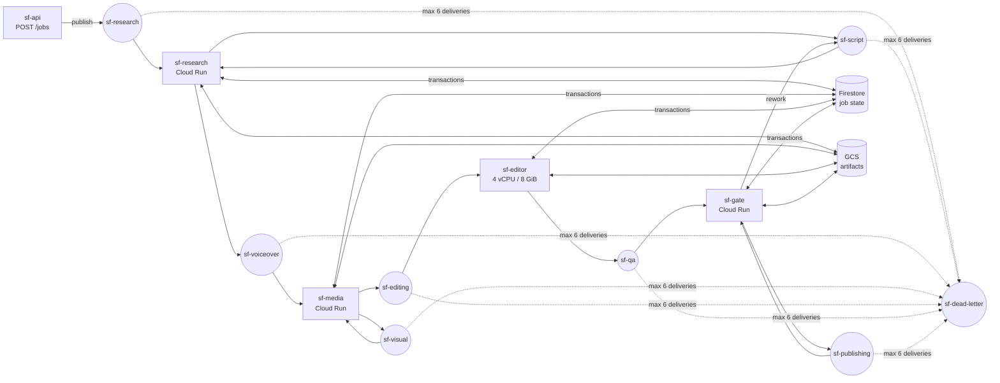

# shortforge

**Event-driven multi-agent platform that turns a topic into a production-ready vertical short (1080×1920, ≤ 59 s) — using free / open-source AI models, with automatic fallbacks so it never hard-stops.**

```
topic ─▶ Research ─▶ Script ─▶ Voiceover ─▶ Visual ─▶ Editing ─▶ QA ─▶ Publishing ─▶ MP4 + thumbnail + metadata
                        ▲                                          │
                        └──────────── rework with feedback ◀───────┘   (bounded, routed to the stage that can fix it)
```

```bash
pip install -e .            # needs ffmpeg on PATH (+ espeak-ng for a voice)
shortforge run "the lighthouse keeper who never left"
```

Runs with **zero API keys**: offline fallbacks (template writer, procedural images, espeak/silent narration) keep every stage working, and each stage reports when it was `degraded`. Add free keys to upgrade quality.

---

## What it does

| Agent | Job | Providers (priority order — free / open first) |
|---|---|---|
| **Research** | Retrieve grounding material, distil a creative brief | Wikipedia API → offline · LLM chain for the brief |
| **Script** | 6–9 narrated beats + one image prompt per beat; schema-validated, word-budgeted, content blocklist | Groq (Llama 3.3 70B) → OpenRouter `:free` → Gemini → Ollama (local) → offline writer |
| **Voiceover** | Per-beat TTS → exact beat timings; speeds up ≤ 1.25× to fit the 60 s cap | Piper (neural, MIT) → espeak-ng → timed silence |
| **Visual** | One 9:16 image per beat, generated concurrently (bounded), validated | Pollinations FLUX (no key) → HF Inference FLUX.1-schnell → Pexels → procedural renderer |
| **Editing** | FFmpeg: per-beat Ken Burns clips (parallel), burned captions, loudness-normalised narration + generated ambient bed, thumbnail | FFmpeg / libass |
| **QA** | Release gate: ffprobe stream/resolution/codec, duration limits, A/V sync, black-frame ratio, loudness, optional LLM-as-judge; failures **route back** to the stage that can fix them | ffmpeg `blackdetect` / `volumedetect`, LLM chain |
| **Publishing** | Idempotent fan-out with per-target receipts | Local folder, YouTube Data API (private by default) |

## Architecture



* **Event-driven orchestration** — one Pub/Sub topic per stage with *push* subscriptions to Cloud Run. A handler returning 2xx acks; 5xx nacks and Pub/Sub redelivers with exponential backoff (10 s → 600 s), then dead-letters. Stages are grouped into services sized for their workload (the FFmpeg editor gets 4 vCPU / 8 GiB at concurrency 1; research runs on 1 vCPU) — independent scaling and failure isolation.
* **Persistent workflow state** — each job is a Firestore document with per-stage status, attempts, lease, timings, outputs, and an event log. Every transition is a transactional read-modify-write.
* **Exactly-once *effects* on at-least-once delivery** — stage leases (owner + expiry) claimed in a transaction; completed stages are never re-executed (duplicates just re-emit downstream); messages carry the job `revision`, so stale messages from before a QA rework are dropped; expired leases from crashed workers are taken over.
* **Resumability** — `shortforge resume <job>` / `POST /jobs/{id}/resume` restarts from the first incomplete stage, reusing all completed work. Artifacts are namespaced by revision (`jobs/<id>/r<rev>/<stage>/…`) so reworks never overwrite files an older revision might read.
* **Provider fallback chains + circuit breakers** — each capability is a priority list. Unconfigured providers are skipped; failures fall through; after N consecutive failures a provider's breaker opens for a cooldown (free tiers usually fail via rate-limit windows, so fail over fast instead of hammering). Long `Retry-After` → fail over immediately; short → wait once.
* **LLM output is untrusted input** — JSON extraction tolerant of fences/preambles, schema + constraint validation, one repair round-trip per provider with the validation error fed back, then fall through.
* **Same code locally and on GCP** — `Bus`, `StateStore` and `ArtifactStore` interfaces with local (in-memory bus with identical ack/nack/backoff/DLQ semantics, SQLite `BEGIN IMMEDIATE`, filesystem) and GCP (Pub/Sub, Firestore, GCS) implementations.

Deep dive: [`docs/ARCHITECTURE.md`](docs/ARCHITECTURE.md).

## Quick start

```bash
# system deps: ffmpeg (required), espeak-ng (voice), DejaVu fonts (captions)
sudo apt-get install ffmpeg espeak-ng fonts-dejavu-core     # macOS: brew install ffmpeg espeak-ng

python -m venv .venv && source .venv/bin/activate
pip install -e ".[service]"
cp .env.example .env            # optional: add free keys

shortforge providers            # which providers are configured
shortforge run "the cursed elevator that stops at floor 13"
shortforge status               # list jobs
shortforge status <job_id>      # per-stage status, attempts, timings, provider used, QA verdict
shortforge resume <job_id>      # continue a failed job from its last good stage
```

Output lands in `output/<job_id>/` — `video.mp4`, `thumbnail.jpg`, `metadata.json` (title, description, hashtags, sources, `ai_generated`, degraded stages).

**Free keys worth adding** (all optional): `GROQ_API_KEY` (best free LLM quality/latency), `HF_API_TOKEN` (FLUX images if Pollinations is down), `PEXELS_API_KEY`. For a natural voice: `pip install piper-tts`, download a voice from [rhasspy/piper-voices](https://huggingface.co/rhasspy/piper-voices) and set `SF_PIPER_MODEL` (the Docker image bakes one in). Or run `ollama pull llama3.1:8b` for a fully local LLM.

### HTTP service / Docker

```bash
docker build -t shortforge .
docker run -p 8080:8080 --env-file .env shortforge          # local backend, pipeline runs in-process
curl -X POST localhost:8080/jobs -H 'Content-Type: application/json' -d '{"topic":"the well behind the school"}'
curl localhost:8080/jobs/<job_id>
```

### Deploy to GCP

```bash
export PROJECT=my-project REGION=asia-south1
./deploy/gcp/deploy.sh   # idempotent
```

Provisions Firestore, a GCS bucket (30-day lifecycle), Artifact Registry, Secret Manager entries for any keys in `.env`, 5 Cloud Run services (private, IAM-invoked), 7 topics with OIDC push subscriptions, retry policy and a dead-letter topic. The final MP4 stays in GCS; YouTube upload is enabled automatically when OAuth credentials are present.

## Observability

* Structured JSON logs on Cloud Run (`severity`, `job_id`, `stage`, `trace_id`, `worker`, `latency_ms`, `provider`) — queryable in Cloud Logging, pretty-printed locally.
* Each stage output carries `_metrics`: provider used, model, token usage, fallback attempts with per-provider latency and error.
* Job event log: `stage_started / completed / failed`, `lease_takeover`, `rework`, `needs_review`.
* QA output: every check with value + expectation + routing target, and which stages ran degraded.

## Tests

```bash
pip install -e ".[dev]"
pytest -m "not e2e"   # orchestration semantics, bus, state, chains, LLM repair, validators, HTTP push endpoint
pytest -m e2e         # full pipeline: real FFmpeg render + espeak-ng, offline providers
```

The orchestration suite covers: in-order execution, duplicate delivery idempotency, transient retry, retry exhaustion → fail → resume without recomputing upstream, fatal errors, QA rework loop, rework budget → `needs_review`, stale-revision drop, live-lease contention, expired-lease takeover. CI runs all of it plus a CLI smoke render and a Docker build/health check, and uploads the sample video as a build artifact.

## Configuration

All via environment (see [`.env.example`](.env.example)): provider order (`SF_LLM_PROVIDERS`, `SF_IMAGE_PROVIDERS`, `SF_TTS_PROVIDERS`), reliability (`SF_MAX_STAGE_ATTEMPTS`, `SF_MAX_QA_REVISIONS`, `SF_STAGE_LEASE_SECONDS`, `SF_BREAKER_THRESHOLD`), content (`SF_WORDS_MIN/MAX`, `SF_MAX_VIDEO_SECONDS`, resolution, `SF_RENDER_PRESET`), and `SF_OFFLINE=1` to force offline providers.

## Responsible use

Uploads default to **private**, and YouTube's `containsSyntheticMedia` flag is set. Scripts pass a content blocklist and the prompts forbid real private individuals, gore and sexual content. Check each provider's terms before commercial use.

## License

MIT
